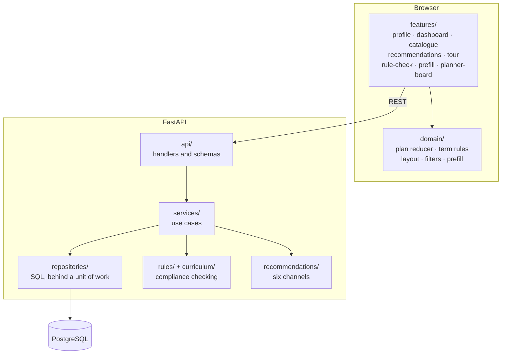

# Architecture

## Overview



## Backend layers

A handler validates its input, calls exactly one service, and shapes the reply.
It holds no business rules and no SQL. A service holds one use case, decides
whether that use case needs a transaction, and reaches storage through a unit of
work that hands it every repository already bound to one connection. A repository
holds SQL and nothing else.

Services raise errors named for what went wrong: `ProgrammeLocked`,
`StartTermLocked`, `SetupIncomplete`, `UnsupportedProgramme`. One table, in
`app/api/errors.py`, maps those to status codes, and it is the only place in the
application that knows what a status code is.

### Compliance checking

`app/curriculum/bachelor.json` and `master.json` hold the regulations: which
modules exist, what each is worth, which course code belongs to which module,
which courses the bachelor's introductory phase gates. `app/rules/` holds the
checking.

The two programmes have separate rule sets. Measured line by line the two
checkers share four per cent of their text: the bachelor curriculum has an
introductory-phase gate with no counterpart in the master programme, the master
programme has a focus-area dependency structure with no counterpart in the
bachelor, and normalising a title differs because the bachelor's titles are
German and have to be accent-folded before they can be matched. What they share
is the wire format, the result shape, the entry point, the shape of a rule set,
and the reading of the credit limits. Both files are organised the same way.

### Recommendations

Six channels: interest, similarity, sequence, completed, internship and peer.
Each is an object with a name and one method, composed by an engine. The engine
iterates candidates outer and channels inner: a course is recommended once, and
the first channel to claim it supplies the reason the student is shown.

The knowledge graph in `knowledge.py` is a prototype fixture whose course codes
do not exist in either catalogue, so against real data the `sequence` and
`completed` channels never fire. Output does not vary between server restarts,
because iteration order is not left to Python's per-process hash randomisation,
and the golden master pins that.

## Frontend

`src/domain/` is framework-free. It can be imported and exercised without React,
a browser or a network, and it holds the plan reducer, the term and lane rules,
the lane geometry, the graph filters and the three prefill builders. `features/`
holds React: one directory per feature, each a hook or two owning that feature's
state and effects plus the components that render it. `App.jsx` assembles them.

### Plan reducer

```
(state, action) -> state
```

No clock, no randomness, no I/O, so a transition can be tested by calling it. A
recorded change carries a monotonic counter rather than a timestamp, because
consumers compare identifiers to tell a stale answer from a current one.

### Planner invariants

**A course's horizontal position is its semester.** The plan and the React Flow
node array are two representations of the same data, kept in sync in both
directions: `nodes-to-plan.ts` derives which semester a course is in from its
`position.x` and its order within that semester from `position.y`, while a
rebuild reconstructs the node graph from the plan on programme switch and first
load. Between them sit four effects that patch node data in place.

**The commit points differ by mutation.** Some mutations write the plan
immediately and clear a flag; the drag handlers only raise the flag and let an
effect commit a render later. The recorded change is what triggers the rule
check, the recommendations request and the rollback machinery, so changing when
it fires produces duplicate checks or spurious rollbacks.

**Rollback is silent.** When the rule engine refuses a change, the planner undoes
it. Recording that undo as a plan change would ask the rule engine to check
again, whose refusal would roll back again, for ever. The reducer therefore takes
`meta.silent` on the ordinary action, handled in one place. Two further
invariants hold the rest of it together: a per-programme change identifier tells
a stale answer from a current one, and the rollbacks find their nodes by the ids
recorded in the diff, so they must run against the array that diff was taken from
(the hook's `setNodes` input is typed updater-only, so the shape that would let
it capture a stale array does not compile).

## Data

The plan is stored as one JSON document per user rather than as rows per placed
course. The frontend owns the plan's shape and rewrites it whole on every change.
The catalogue is fully normalised, and is served to the frontend from a
materialised view that already holds the nested JSON the interface wants.

Migrations are `YYYYMMDDHHMM_slug.sql`, applied in lexical order, recorded with a
checksum, and forward-only. `sql/_ledger.psql` creates the ledger and remaps the
old sequence-numbered names; it is not a migration, and it is named `.psql` so
the migration scan does not pick it up.

## Tests

The thesis reports what eleven evaluation participants experienced, so behaviour
has to be preserved exactly. Three layers of test make that checkable: a golden
master over the rule engine and the recommender, a contract test over every
endpoint's status and response shape, and end-to-end flows over what the study
observed. The first two are recordings of current output rather than hand-written
assertions.
